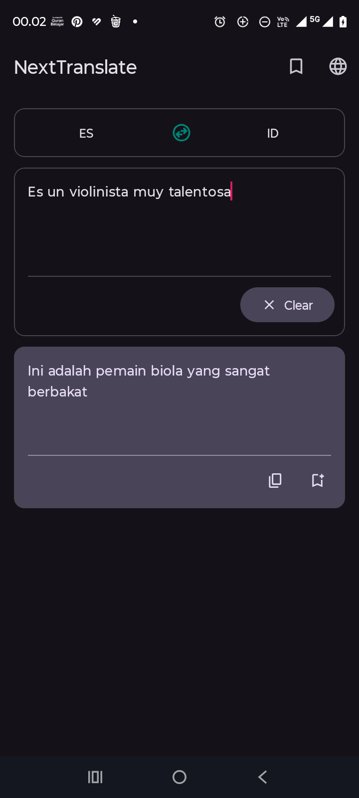
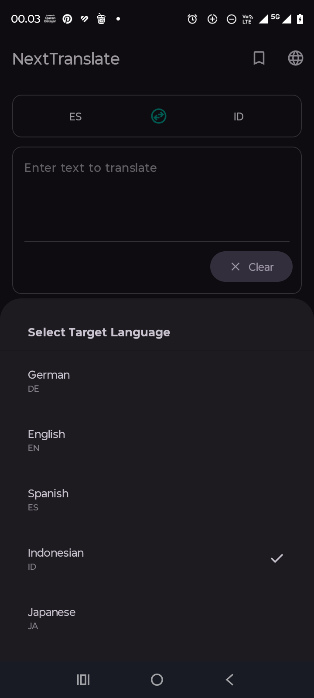
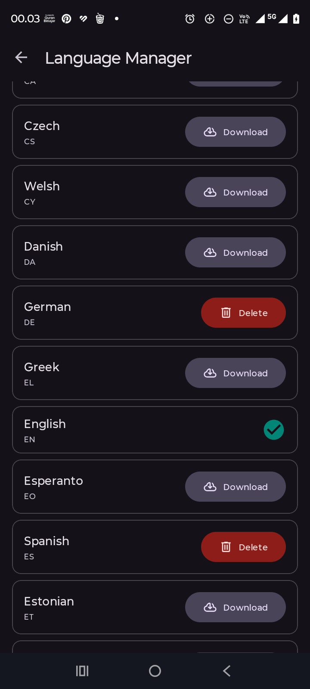
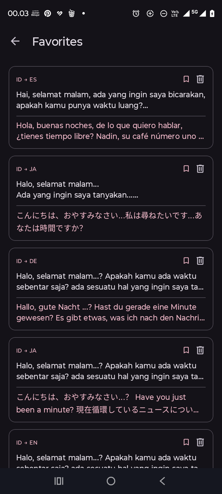

# NextTranslate

A native Android translation app built with **Java**, **XML**, and **Clean Architecture**.  
Powered by **Google ML Kit Translate** for fully offline, on-device translation.

---

## Features

- **Offline translation** — no internet required once language models are downloaded
- **Auto-translate** — triggers automatically after the user stops typing (1 second debounce)
- **Language detection** — automatically detects the source language using ML Kit Language Identification
- **Language Manager** — download or delete ML Kit translation models per language
- **Translation History** — every translation is saved locally and browsable
- **Favorites** — bookmark translations for quick access later
- **Copy to clipboard** — one-tap copy of translated text
- **File-based logging** — internal `FileLogger` utility for debug tracing

---

## Tech Stack

| Layer        | Technology                          |
|--------------|-------------------------------------|
| Language     | Java                                |
| UI           | XML Layouts + ViewBinding           |
| Architecture | Clean Architecture (3-layer)        |
| Local DB     | Room (SQLite)                       |
| Translation  | Google ML Kit Translate             |
| Lang Detect  | Google ML Kit Language Identification |
| Threading    | Custom `AppExecutors` (no RxJava)   |
| DI           | Manual (`AppContainer`)             |
| State        | `LiveData` + `ViewModel`            |

---

## Architecture

NextTranslate follows **Clean Architecture** with a strict 3-layer separation:

```
Presentation Layer  →  Domain Layer  →  Data Layer
   (UI / ViewModel)     (Use Cases)     (Repository / Room / ML Kit)
```

Dependencies flow **inward only** — the domain layer has zero dependency on Android or ML Kit.  
The `data` layer implements domain interfaces, and the `presentation` layer consumes domain use cases.

### Dependency Injection

Manual DI is used via `AppContainer`, instantiated once in `NextTranslateApp`.  
No Hilt or Dagger — keeping the project lightweight and straightforward.

```java
AppContainer container = NextTranslateApp.getContainer();
TranslateTextUseCase useCase = container.getTranslateTextUseCase();
```

---

## Project Structure

```
app/src/main/java/com/igoy86/nexttranslate/
│
├── MainActivity.java                          # Single host Activity (Fragment navigation)
├── NextTranslateApp.java                      # Application class — initializes AppContainer & FileLogger
│
├── di/
│   └── AppContainer.java                      # Manual DI container — builds full dependency graph
│
├── data/
│   ├── local/
│   │   ├── dao/
│   │   │   ├── HistoryDao.java                # Room DAO for translation history
│   │   │   └── FavoriteDao.java               # Room DAO for favorite translations
│   │   ├── database/
│   │   │   └── AppDatabase.java               # Room database (singleton)
│   │   └── entity/
│   │       ├── HistoryEntity.java             # Room entity for history table
│   │       └── FavoriteEntity.java            # Room entity for favorites table
│   ├── mapper/
│   │   ├── HistoryMapper.java                 # Maps HistoryEntity ↔ HistoryItem (domain)
│   │   └── FavoriteMapper.java                # Maps FavoriteEntity ↔ FavoriteItem (domain)
│   └── repository/
│       ├── TranslateRepositoryImpl.java       # ML Kit Translate + Language ID implementation
│       ├── LanguageModelRepositoryImpl.java   # ML Kit model download/delete implementation
│       ├── HistoryRepositoryImpl.java         # Room-backed history persistence
│       └── FavoriteRepositoryImpl.java        # Room-backed favorites persistence
│
├── domain/
│   ├── model/
│   │   ├── TranslationResult.java             # Result of a translation operation
│   │   ├── LanguageModel.java                 # Represents a supported language + download state
│   │   ├── HistoryItem.java                   # Domain model for a history entry
│   │   ├── FavoriteItem.java                  # Domain model for a favorite entry
│   │   └── DownloadProgress.java              # Holds ML Kit model download progress state
│   ├── repository/
│   │   ├── TranslateRepository.java           # Interface: translation & language detection
│   │   ├── LanguageModelRepository.java       # Interface: model download/delete/list
│   │   ├── HistoryRepository.java             # Interface: history CRUD
│   │   └── FavoriteRepository.java            # Interface: favorites CRUD
│   └── usecase/
│       ├── translate/
│       │   ├── TranslateTextUseCase.java      # Execute a text translation
│       │   └── DetectLanguageUseCase.java     # Detect language of input text
│       ├── language/
│       │   ├── DownloadLanguageModelUseCase.java  # Download an ML Kit language model
│       │   ├── DeleteLanguageModelUseCase.java    # Delete a downloaded language model
│       │   └── GetDownloadedLanguagesUseCase.java # List all downloaded language models
│       ├── history/
│       │   ├── AddHistoryUseCase.java         # Add a translation to history
│       │   ├── GetAllHistoryUseCase.java      # Retrieve all history entries
│       │   ├── DeleteHistoryUseCase.java      # Delete a single history entry
│       │   └── ClearAllHistoryUseCase.java    # Clear all history entries
│       └── favorite/
│           ├── AddFavoriteUseCase.java        # Add a translation to favorites
│           ├── GetAllFavoritesUseCase.java    # Retrieve all favorite entries
│           └── DeleteFavoriteUseCase.java     # Delete a favorite entry
│
├── presentation/
│   ├── base/
│   │   ├── BaseActivity.java                  # Abstract Activity with ViewBinding setup
│   │   ├── BaseFragment.java                  # Abstract Fragment with ViewBinding setup
│   │   └── BaseViewModel.java                 # Abstract ViewModel with shared utilities
│   ├── translate/
│   │   ├── TranslateFragment.java             # Main translation screen
│   │   ├── TranslateViewModel.java            # Translation UI state & business logic
│   │   ├── TranslateViewModelFactory.java     # Factory for TranslateViewModel
│   │   └── LanguagePickerBottomSheet.java     # Bottom sheet for source/target language selection
│   ├── history/
│   │   ├── HistoryFragment.java               # Translation history screen
│   │   ├── HistoryViewModel.java              # History UI state
│   │   ├── HistoryViewModelFactory.java       # Factory for HistoryViewModel
│   │   └── HistoryAdapter.java                # RecyclerView adapter for history list
│   ├── favorite/
│   │   ├── FavoriteFragment.java              # Favorites screen
│   │   ├── FavoriteViewModel.java             # Favorites UI state
│   │   ├── FavoriteViewModelFactory.java      # Factory for FavoriteViewModel
│   │   └── FavoriteAdapter.java               # RecyclerView adapter for favorites list
│   └── language/
│       ├── LanguageFragment.java              # Language Manager screen
│       ├── LanguageViewModel.java             # Language model download/delete UI state
│       ├── LanguageViewModelFactory.java      # Factory for LanguageViewModel
│       └── LanguageAdapter.java               # RecyclerView adapter for language list
│
└── util/
    ├── AppExecutors.java                      # Thread pools: diskIO, networkIO, mainThread
    ├── Resource.java                          # Generic state wrapper: SUCCESS / ERROR / LOADING / PROGRESS
    └── FileLogger.java                        # File-based logging utility for debug tracing
```

---

## Navigation

Single-Activity architecture. `MainActivity` hosts all screens as Fragments swapped via `FragmentManager`.

```
TranslateFragment (root)
    ├── → HistoryFragment
    ├── → FavoriteFragment
    └── → LanguageFragment
```

---

## Database

Room database (`nexttranslate.db`) with two tables:

| Table       | Entity              | Description                        |
|-------------|---------------------|------------------------------------|
| `history`   | `HistoryEntity`     | All past translations              |
| `favorites` | `FavoriteEntity`    | User-bookmarked translations       |

---

## Resource State Wrapper

All async operations (translation, DB, model download) return `LiveData<Resource<T>>`.

```java
resource.getStatus() // SUCCESS | ERROR | LOADING | PROGRESS
resource.getData()   // the result payload, nullable
resource.getMessage()// error message, nullable
```

---

## Getting Started

### Prerequisites

- Android Studio Hedgehog or newer
- Android SDK 24+
- Internet connection on first run (to download ML Kit language models)

### Setup

1. Clone the repository
   ```bash
   git clone https://github.com/your-username/nexttranslate.git
   ```
2. Open the project in Android Studio
3. Sync Gradle and run on a physical device or emulator
4. On the **Language Manager** screen, download the language pairs you need
5. Once downloaded, all translations work fully offline

---

## License

```
MIT License

Copyright (c) 2026 igoy86

Permission is hereby granted, free of charge, to any person obtaining a copy
of this software and associated documentation files (the "Software"), to deal
in the Software without restriction, including without limitation the rights
to use, copy, modify, merge, publish, distribute, sublicense, and/or sell
copies of the Software, and to permit persons to whom the Software is
furnished to do so, subject to the following conditions:

The above copyright notice and this permission notice shall be included in all
copies or substantial portions of the Software.

THE SOFTWARE IS PROVIDED "AS IS", WITHOUT WARRANTY OF ANY KIND, EXPRESS OR
IMPLIED, INCLUDING BUT NOT LIMITED TO THE WARRANTIES OF MERCHANTABILITY,
FITNESS FOR A PARTICULAR PURPOSE AND NONINFRINGEMENT. IN NO EVENT SHALL THE
AUTHORS OR COPYRIGHT HOLDERS BE LIABLE FOR ANY CLAIM, DAMAGES OR OTHER
LIABILITY, WHETHER IN AN ACTION OF CONTRACT, TORT OR OTHERWISE, ARISING FROM,
OUT OF OR IN CONNECTION WITH THE SOFTWARE OR THE USE OR OTHER DEALINGS IN THE
SOFTWARE.
```

##Screenshot 







<p>
  
  
  
  
  
</p>